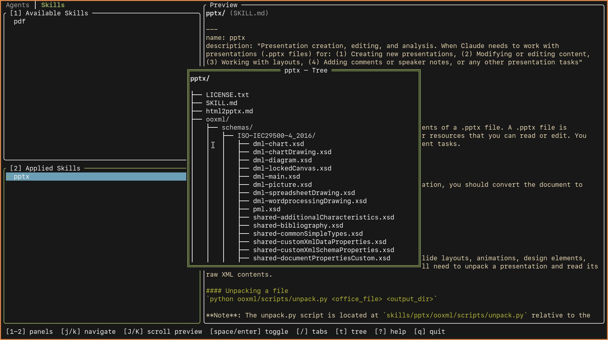

# LazyClaude

A lazygit-inspired terminal UI for managing Claude Code resources. Browse, preview, and toggle agents, skills, and other resources between a global store and your project with a single keypress.



## Features

- **Intuitive TUI** — Available and Applied lists let you see what's in your global store vs. what's linked into your project
- **Category tabs** — Switch between resource types (agents, skills, commands, etc.) with `[` and `]`
- **Symlink-based** — Resources are applied by creating symlinks from your project's `.claude/` directory to the global store, keeping a single source of truth
- **Live preview** — Syntax-highlighted file preview with Chroma (supports Go, Python, JS, TS, YAML, JSON, Markdown, Bash, Rust, Ruby, TOML)
- **Directory-aware** — Directories show their `SKILL.md` if present, or a tree view up to 3 levels deep
- **Tree modal** — Press `t` on any directory to inspect its full structure in an overlay
- **Vim-style navigation** — `h/j/k/l`, panel numbers, Tab cycling — everything you'd expect from a lazy style TUI
- **Broken symlink cleanup** — Automatically detects and removes stale symlinks on refresh
- **Rounded borders** — Clean visual style with `╭╮╰╯` box-drawing characters and a gruvbox-inspired color scheme

## Installation

### Prerequisites

- [Go](https://go.dev/) 1.22 or later

### Build from source

```bash
git clone https://github.com/ramy/lazyclaude.git
cd lazyclaude
make build
```

The binary is written to `./lazyclaude`.

### Install to PATH

```bash
make install
```

This copies the binary to `~/.local/bin/`. Make sure `~/.local/bin` is in your `$PATH`.

## Configuration

LazyClaude resolves its config directory in this order:

1. `$LAZYCLAUDE_CONFIG_DIR` — if set, used directly
2. `$XDG_CONFIG_HOME/lazyclaude` — if `XDG_CONFIG_HOME` is set
3. `~/.config/lazyclaude` — default fallback

The config file is expected at `<config_dir>/config.yaml`.

For example, to set a custom config directory:

```bash
export LAZYCLAUDE_CONFIG_DIR="$XDG_CONFIG_HOME/lazyclaude"
```

### Config file

```yaml
# Global resource store — where your agents, skills, etc. live
resources_dir: $HOME/.config/claude

# Project .claude directory — where symlinks are created (REQUIRED)
claude_dir: /path/to/your/project/.claude
```

| Field | Required | Default | Description |
|-------|----------|---------|-------------|
| `resources_dir` | No | `~/.config/claude` | Root directory containing resource subdirectories |
| `claude_dir` | **Yes** | — | Project-specific `.claude` directory to manage |

Both values support environment variable expansion (`$HOME`, `$USER`, etc.).

### Directory structure

LazyClaude expects your global store to be organized into subdirectories by resource type:

```
~/.config/claude/              # resources_dir
├── agents/
│   ├── code-reviewer.md
│   └── debugger.md
├── skills/
│   ├── pdf/
│   │   ├── SKILL.md
│   │   └── ...
│   └── pptx/
│       ├── SKILL.md
│       └── ...
└── models/
    └── custom-models.yaml
```

When you apply a resource, a symlink is created in the project directory:

```
/your/project/.claude/         # claude_dir
├── skills/
│   └── pdf → ~/.config/claude/skills/pdf
└── agents/
    └── debugger.md → ~/.config/claude/agents/debugger.md
```

## Usage

```bash
lazyclaude
```

### UI Layout

```
╭─────────────────────────────────────────────────────────╮
│  Agents │ Skills │ Models │ ...          (category tabs) │
├────────────────────┬────────────────────────────────────┤
│ [1] Available      │ Preview                            │
│   item-a           │                                    │
│   item-b           │ (syntax-highlighted content of     │
│ ▸ item-c           │  the selected item, or SKILL.md    │
│   item-d           │  for directories, or a tree view)  │
│                    │                                    │
├────────────────────┤                                    │
│ [2] Applied        │                                    │
│ + linked-item-1    │                                    │
│ + linked-item-2    │                                    │
│                    │                                    │
├────────────────────┴────────────────────────────────────┤
│ [1-2] panels [j/k] navigate [J/K] scroll preview ...   │
╰─────────────────────────────────────────────────────────╯
```

- **Left column** — Two navigable panels: Available (resources not yet applied) and Applied (symlinked resources)
- **Right column** — Preview pane showing the contents of the selected item
- **Top** — Category tabs for switching resource types
- **Bottom** — Status bar with keybinding hints

### Applying and removing resources

1. Navigate to an item in the **Available** panel using `j`/`k`
2. Press `Space` or `Enter` to **apply** it — a symlink is created in your project's `.claude/` directory
3. The item moves to the **Applied** panel with a green `+` prefix
4. To **remove** a resource, switch to the Applied panel (`2` or `Tab`), select it, and press `Space` or `Enter` — the symlink is deleted

### Browsing directories

When a directory-type resource is selected:
- If it contains a `SKILL.md`, the preview shows its syntax-highlighted contents
- Otherwise, the preview shows a tree view of the directory (up to 3 levels deep)
- Press `t` to open a **tree modal** overlay for a full view of the directory structure

## Keybindings

### Navigation

| Key | Action |
|-----|--------|
| `j` / `k` | Move cursor down / up in the focused list |
| `J` / `K` | Scroll the preview pane down / up |
| `h` / `l` | Switch to previous / next panel |
| `1` / `2` | Jump directly to panel 1 (Available) or 2 (Applied) |
| `Tab` | Cycle to next panel |
| `Shift+Tab` | Cycle to previous panel |

### Tabs

| Key | Action |
|-----|--------|
| `]` | Next category tab |
| `[` | Previous category tab |

Tab switching wraps around — pressing `]` on the last tab goes back to the first.

### Actions

| Key | Action |
|-----|--------|
| `Space` / `Enter` | Toggle selected item (apply from Available, remove from Applied) |
| `t` | Open tree modal for the selected directory |

### Modals

| Key | Action |
|-----|--------|
| `?` | Open help modal |
| `Esc` / `q` | Close current modal, or quit if no modal is open |

Modals are overlays that appear centered on screen. While a modal is open, `Esc` or `q` closes it instead of quitting the application.

## How it works

LazyClaude operates on a simple model:

1. **Global store** (`resources_dir`) — A directory tree where each subdirectory is a resource category containing your agents, skills, and other Claude resources
2. **Project directory** (`claude_dir`) — Your project's `.claude/` directory where resources are made available via symlinks
3. **Categories** — Automatically discovered by scanning the top-level subdirectories of the global store
4. **Apply** — Creates a symlink: `claude_dir/<category>/<name> → resources_dir/<category>/<name>`
5. **Remove** — Deletes the symlink, leaving the global resource untouched
6. **Validation** — On every refresh, broken symlinks (pointing to moved/deleted resources) are automatically cleaned up

## Dependencies

| Package | Purpose |
|---------|---------|
| [tview](https://github.com/rivo/tview) | TUI framework — Application, Flex, List, TextView, Pages |
| [tcell](https://github.com/gdamore/tcell) | Terminal cell rendering, colors, input handling |
| [chroma](https://github.com/alecthomas/chroma) | Syntax highlighting for file preview |
| [yaml.v3](https://pkg.go.dev/gopkg.in/yaml.v3) | Config file parsing |

## Development

```bash
# Build
make build

# Build and run
make run

# Clean build artifacts
make clean
```

The entire application is a single `main.go` file (~895 lines) with no external configuration beyond the YAML config file.
